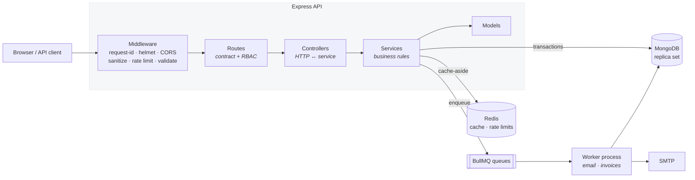
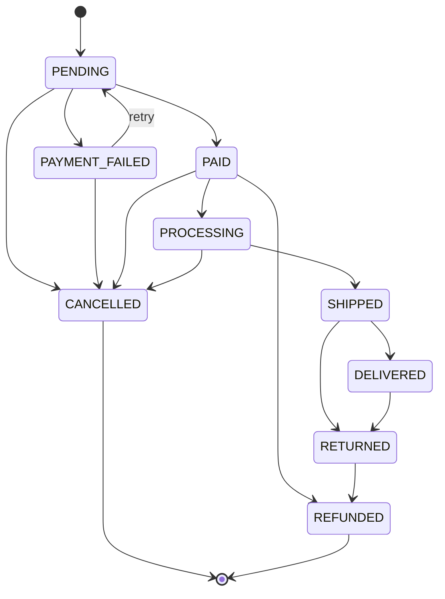

<div align="center">

# 🛒 ShopCore

**A production-grade e-commerce backend — the invisible engineering, not just the CRUD.**

Multi-role commerce API covering the full lifecycle: browse → cart → checkout → payment → fulfilment → review.
Built as a modular monolith on Node.js, Express, MongoDB and Redis.

[](https://github.com/RUSHI-GADHIYA/shopcore/actions/workflows/ci.yml)


</div>

---

## Why this exists

Most portfolio backends stop at "it does CRUD and returns JSON". This one is built around the
problems that only show up when a real system meets real traffic:

> **Two customers click _Buy_ on the last item at the same moment.** Exactly one succeeds — and
> there is a test that fires both concurrently to prove it.
>
> **A payment gateway sends the same webhook four times.** The order moves once, one email goes
> out, one invoice is generated.
>
> **A cart of thirty lines has to total correctly.** All money arithmetic runs in integer cents,
> because `0.1 + 0.2 !== 0.3` and a large cart compounds that into a total that disagrees with the
> sum of its own lines.

---

## At a glance

|                 |                                                                                                        |
| --------------- | ------------------------------------------------------------------------------------------------------ |
| **Modules**     | 11 — auth, users, categories, products, cart, orders, payments, reviews, coupons, notifications, admin |
| **API surface** | 40 paths · 50 operations · fully documented in OpenAPI 3.0                                             |
| **Tests**       | 376 across 22 suites, plus 43 end-to-end checks and 9 container smoke checks                           |
| **Code**        | ~7,700 lines of source · ~4,900 lines of tests                                                         |
| **Security**    | 0 npm vulnerabilities · signature-verified webhooks · rotating refresh tokens                          |
| **Verified by** | CI on Node 20 & 22, a real Docker image booted against live Mongo + Redis                              |

---

## ✨ Highlights

<table>
<tr>
<td width="50%" valign="top">

### 🔐 Auth that assumes hostility

Refresh tokens are stored **only as a SHA-256 hash** and rotate on every use. Replaying an old one
is treated as theft: the stored token is cleared, ending every session. Login answers identically —
**in message _and_ timing** — whether the account is unknown or the password wrong.

</td>
<td width="50%" valign="top">

### 💳 Payments the way gateways actually work

Nothing confirms synchronously. `initiate` records an intent; the order becomes `PAID` only on a
**HMAC-verified callback**. Handling is idempotent, because gateways retry until they see a 2xx.
Swapping in Stripe is one adapter file.

</td>
</tr>
<tr>
<td width="50%" valign="top">

### 🧾 Checkout that cannot oversell

Stock decrement, order creation, coupon redemption and cart clearing happen in **one MongoDB
transaction**. Each decrement is a _conditional_ update asserting sufficient stock, so two
simultaneous checkouts for the last unit cannot both win.

</td>
<td width="50%" valign="top">

### 🎯 The server prices the order

Checkout accepts an address, a note and a coupon code. **Not the items. Not the prices. Not the
total.** Line prices are re-read from the catalogue at checkout, so a stale cart price is never
what gets charged.

</td>
</tr>
<tr>
<td width="50%" valign="top">

### 🖼️ Uploads that assume the file is hostile

Images are decoded and **re-encoded to WebP** before touching disk — a `.png` that is really a
script does not survive that. Filenames are generated server-side. There is a test that uploads
`GIF89a<?php … ?>` declared as `image/png`.

</td>
<td width="50%" valign="top">

### ⭐ Reviews you have to earn

A review cannot exist without pointing at the **`DELIVERED` order** that entitles it — paid is not
enough. One per user per product, enforced by a unique index rather than a check-then-write a race
can slip between.

</td>
</tr>
<tr>
<td width="50%" valign="top">

### ⚡ Caching that is never a dependency

Every cache helper swallows its own errors and reports a miss, so a Redis outage costs latency, not
uptime. Invalidation uses `SCAN`, never `KEYS` — which blocks the Redis event loop across the whole
keyspace.

</td>
<td width="50%" valign="top">

### 🧪 A browser harness for the whole API

A dependency-free page that drives every endpoint, including a **dev-only** signed-webhook
simulator. It found a real API inconsistency that 367 module tests could not see.

</td>
</tr>
</table>

---

## 🏗️ Architecture



Each module is layered — **routes** declare the contract and attach middleware, **controllers**
adapt HTTP to a service call, **services** hold the rules and are the only layer touching models.
Splitting `app.js` (pure wiring, no I/O) from `server.js` (connect, listen, shut down) is what lets
integration tests run the whole stack against an in-memory Mongo without opening a port.

<details>
<summary><b>Project layout</b></summary>

```
src/
├── config/       env validation, Mongo, Redis, Winston
├── docs/         OpenAPI definition
├── jobs/         BullMQ queues, shared handlers, worker entry point
├── middlewares/  request id, auth, RBAC, validation, rate limiting, uploads, errors
├── modules/      auth · users · categories · products · cart · orders
│                 payments · reviews · coupons · notifications · admin
├── routes/       versioned API index + health checks
├── utils/        ApiError, ApiResponse, asyncHandler, pagination, slugs, cache, money
├── app.js        Express wiring — this is what the tests mount
└── server.js     process entry: connect, listen, shut down gracefully

public/           browser test harness (no build step)
scripts/          seed · smoke test · end-to-end flow
tests/            unit + integration (mongodb-memory-server)
```

</details>

---

## 🚀 Quick start

```bash
git clone https://github.com/RUSHI-GADHIYA/shopcore.git
cd shopcore
cp .env.example .env          # then fill in the JWT + webhook secrets
docker compose up -d          # Mongo (replica set) + Redis
npm install
npm run seed                  # admin / seller / customer accounts + catalogue
npm run dev
```

Then open:

|                     |                                                  |
| ------------------- | ------------------------------------------------ |
| 🖥️ **Test harness** | <http://localhost:5000>                          |
| 📘 **API docs**     | <http://localhost:5000/api-docs>                 |
| ❤️ **Health**       | <http://localhost:5000/health> · `/health/ready` |

Seeded accounts all use the password `Password123`:

| Email                   | Role     |
| ----------------------- | -------- |
| `admin@shopcore.dev`    | admin    |
| `seller@shopcore.dev`   | seller   |
| `customer@shopcore.dev` | customer |

> **Note** — MongoDB must run as a **replica set**. Checkout uses multi-document transactions, and
> a standalone server cannot do them. The provided `docker-compose.yml` sets this up for you.

<details>
<summary><b>Generating secrets, and the full script list</b></summary>

```bash
node -e "console.log(require('crypto').randomBytes(32).toString('hex'))"
```

The app refuses to boot if any required variable is missing or malformed — see `src/config/env.js`
for the full schema.

| Command                           | What it does                                   |
| --------------------------------- | ---------------------------------------------- |
| `npm run dev`                     | Start with nodemon                             |
| `npm start`                       | Start the server                               |
| `npm run worker`                  | Run the background job worker                  |
| `npm run seed`                    | Seed development data (blocked in production)  |
| `npm run smoke`                   | Smoke-test a running instance over HTTP        |
| `npm run e2e`                     | Walk the whole flow against a running instance |
| `npm test`                        | Jest — unit + integration                      |
| `npm run test:coverage`           | Tests with a coverage report                   |
| `npm run lint` / `npm run format` | ESLint / Prettier                              |

</details>

---

## 🖥️ The browser test harness

`npm run dev`, then open <http://localhost:5000>. A dependency-free page — no build step, no
framework — that drives **every endpoint the API exposes**:

| Tab         | What you can do                                                          |
| ----------- | ------------------------------------------------------------------------ |
| **Account** | Register, sign in as any role, edit profile, manage the address book     |
| **Catalog** | Search, filter, sort, open a product, add a variant to the cart          |
| **Cart**    | Change quantities, see reconciliation flags, preview a coupon, check out |
| **Orders**  | Pay, simulate the gateway callback, replay it, cancel, fulfil, review    |
| **Seller**  | Create products, upload images, restock, low-stock report                |
| **Admin**   | Dashboard, sales trend, categories, coupons, ban / reinstate             |

Tabs are shown by role, but that is **presentation only** — the server enforces the same rules, and
signing in as a customer and calling an admin route still returns 403. Every panel renders the raw
JSON underneath, so what the API actually returned is always visible.

<details>
<summary><b>How the client handles tokens — and why</b></summary>

The access token is held **in memory, not `localStorage`**. It lives fifteen minutes, the refresh
cookie is httpOnly, and a reload re-authenticates silently — so storing it would hand it to any XSS
on the page for no benefit.

A 401 triggers **exactly one** refresh, shared between concurrent requests. Refresh tokens rotate on
use, so firing several refreshes at once would make all but the first look like a replayed token —
which the server correctly treats as theft and answers by killing the session.

</details>

<details>
<summary><b>Simulating a payment from the browser</b></summary>

A browser cannot sign a webhook — that needs `PAYMENT_WEBHOOK_SECRET`, which must never reach a
client. So `POST /payments/dev/simulate` signs server-side and runs the payload through the
**ordinary verified webhook path**, exercising the signature check rather than bypassing it.

**It is not registered at all when `NODE_ENV=production`**, so it cannot forge a payment in a live
deployment. The CI Docker job runs in production mode, so that is continuously verified.

To fire one by hand instead:

```bash
BODY='{"event":"payment.succeeded","data":{"providerRef":"mock_..."}}'
SIG=$(node -e "console.log(require('crypto').createHmac('sha256', process.env.PAYMENT_WEBHOOK_SECRET).update(process.argv[1]).digest('hex'))" "$BODY")

curl -X POST http://localhost:5000/api/v1/payments/webhook \
  -H "Content-Type: application/json" -H "x-shopcore-signature: $SIG" -d "$BODY"
```

</details>

---

## 🔍 Engineering deep-dives

<details>
<summary><b>🧾 Checkout &amp; order integrity</b> — the transaction, and why prices are never trusted</summary>

Two invariants shape the order module.

**The server prices the order.** Checkout accepts an optional `addressId`, a note and a coupon code
— nothing else. Not the items, not the quantities' cost, not the total. Line prices are re-read from
the catalogue at the moment of checkout, so the `priceSnapshot` a client saw in its cart never
becomes the price it pays. A test posts `{total: 0.01, subtotal: 0.01, items: []}` and gets a 422.

**Stock and the order move together.** Decrementing every variant, writing the order, booking the
coupon redemption and emptying the cart happen inside one MongoDB transaction — which is why the
database must be a replica set. Each decrement is also a _conditional_ update whose filter asserts
sufficient stock:

```js
{ _id: line.product, isActive: true,
  variants: { $elemMatch: { sku: line.sku, stock: { $gte: line.quantity } } } }
```

Two simultaneous checkouts for the last unit therefore cannot both succeed — the loser matches no
document and the whole transaction rolls back. There is a test that fires both concurrently and
asserts exactly one 201, one 409, and stock at zero.

**Money never uses floating point.** Every calculation converts to integer cents first
(`src/utils/money.js`), because `0.1 + 0.2` is `0.30000000000000004` and a thirty-line cart
compounds that into a total that disagrees with the sum of its own lines.

</details>

<details>
<summary><b>🔄 The order state machine</b></summary>



`order.state-machine.js` holds the transition table, the roles permitted to drive each transition,
and which transitions return stock to the catalogue. Keeping it in one table rather than scattering
status checks through the service means an illegal transition is **impossible to express**, not
merely unlikely.

Stock is held from `PENDING` through `DELIVERED` and released on any exit from that set —
cancellation, refund or return. A `stockReleasedAt` stamp written _inside_ the transaction stops a
repeated cancellation crediting the catalogue twice. `PAID` and `PAYMENT_FAILED` are reserved for
the payment webhook and cannot be set by any human role.

</details>

<details>
<summary><b>💳 Payments &amp; the webhook contract</b></summary>

The mock gateway reproduces the one thing about a real integration that actually shapes your code:
**nothing is confirmed synchronously.**

- **Signature-authenticated, not session-authenticated.** HMAC-SHA256 over the _raw_ request body,
  compared in constant time. `app.js` retains the raw bytes because re-serialising parsed JSON can
  reorder keys and invalidate the signature.
- **Idempotent.** Gateways retry until they see a 2xx, so the same event arrives repeatedly. A
  `processedAt` stamp means a duplicate changes nothing and _still returns 200_ — anything else
  makes the gateway retry forever.
- **A late callback cannot rewrite history.** If the order has moved on, the payment is recorded but
  the order stays put.
- **One intent per order.** An outstanding `INITIATED` payment is reused rather than opening a
  second — which is how a customer gets charged twice.

Swapping in Stripe means writing one adapter against `PaymentProvider` and widening the
`PAYMENT_PROVIDER` enum. No order logic changes.

</details>

<details>
<summary><b>⚡ Caching, jobs &amp; uploads</b></summary>

**Caching.** Product listings, product detail and the category tree are cached read-through.

- The cache is an optimisation, never a dependency: every helper swallows its own errors and reports
  a miss, so a Redis outage degrades latency rather than returning 500s.
- Invalidation uses `SCAN`, not `KEYS` — `KEYS` blocks the Redis event loop across the entire
  keyspace, which is harmless with ten keys and an outage with a million.
- Writes drop the whole listing namespace rather than computing which pages changed. An over-broad
  invalidation costs one repopulation; a missed one serves a stale price.

**Background jobs.** All transactional email and invoice PDF generation run on BullMQ queues, with
the worker as a separate process so rendering a PDF cannot starve HTTP requests of event-loop time.
Producers and the worker share one set of handlers, so a job behaves identically wherever it runs —
which matters because with `QUEUE_ENABLED=false`, `enqueue()` runs the handler inline instead. The
app is fully functional without Redis, and the test suite exercises the real handlers rather than
asserting a mock was called.

**Uploads.** Images go through `multer` (memory storage) into `sharp`, which resizes to fit 1200px
and re-encodes to WebP before anything touches disk. The re-encoding is the actual security control,
not the mime whitelist: a file that is really a script does not survive being decoded and written
back out. Filenames are generated server-side, so a crafted upload name can never influence the path.

</details>

<details>
<summary><b>🛡️ Security posture</b></summary>

Beyond the standard `helmet` / `cors` / `hpp` / `express-mongo-sanitize` stack:

| Control              | Detail                                                                                 |
| -------------------- | -------------------------------------------------------------------------------------- |
| **Password storage** | bcrypt, hashed in a pre-save hook so no code path can persist plaintext                |
| **Refresh tokens**   | Stored only as a SHA-256 hash, rotated on every use; replay clears the session         |
| **Account lockout**  | After repeated failed logins, with a timing-equalised response                         |
| **Enumeration**      | Login and forgot-password answer identically for known and unknown addresses           |
| **Token revocation** | Access tokens are re-checked against the database every request, so a ban is immediate |
| **Rate limits**      | Redis-backed so they hold across instances; keyed on IP _and_ email on auth routes     |
| **Ownership**        | Enforced in the service layer where the document is in hand, not by role alone         |
| **Input**            | Every route validated by zod; unknown keys rejected, not ignored                       |
| **Dependencies**     | `npm audit` clean, enforced in CI on production dependencies                           |

</details>

---

## 📡 API

Base URL `/api/v1`. Interactive documentation at **`/api-docs`**, raw OpenAPI 3.0 at
`/api-docs.json` — 40 paths, 50 operations.

Every response uses one envelope:

```jsonc
// success
{ "success": true, "data": { }, "message": "…", "meta": { "page": 1, "limit": 20, "total": 134 } }

// error
{ "success": false, "error": { "code": "VALIDATION_ERROR", "message": "…", "details": [ … ] } }
```

<details>
<summary><b>Auth &amp; users</b></summary>

| Method | Endpoint                         | Auth   | Description                        |
| ------ | -------------------------------- | ------ | ---------------------------------- |
| POST   | `/auth/register`                 | Public | Register a customer or seller      |
| POST   | `/auth/login`                    | Public | Access token + refresh cookie      |
| POST   | `/auth/refresh`                  | Cookie | Rotate the refresh token           |
| POST   | `/auth/logout`                   | Auth   | Invalidate the refresh token       |
| POST   | `/auth/forgot-password`          | Public | Email a reset link                 |
| POST   | `/auth/reset-password/:token`    | Public | Set a new password                 |
| GET    | `/auth/verify-email/:token`      | Public | Verify an email address            |
| GET    | `/users/me`                      | Auth   | Current profile                    |
| PATCH  | `/users/me`                      | Auth   | Update name / email                |
| POST   | `/users/me/addresses`            | Auth   | Add an address                     |
| DELETE | `/users/me/addresses/:addressId` | Auth   | Remove an address                  |
| GET    | `/users`                         | Admin  | Search and page the user directory |
| PATCH  | `/users/:id/status`              | Admin  | Ban / reinstate                    |

</details>

<details>
<summary><b>Catalogue</b></summary>

| Method | Endpoint                         | Auth           | Description                             |
| ------ | -------------------------------- | -------------- | --------------------------------------- |
| GET    | `/categories`                    | Public         | Category tree (or `?format=flat`)       |
| GET    | `/categories/:slug`              | Public         | One category                            |
| POST   | `/categories`                    | Admin          | Create a category                       |
| PATCH  | `/categories/:id`                | Admin          | Rename, re-parent, activate             |
| DELETE | `/categories/:id`                | Admin          | Delete (refused while still referenced) |
| GET    | `/products`                      | Public         | Search, filter, sort, paginate          |
| GET    | `/products/:slug`                | Public         | Product detail                          |
| POST   | `/products`                      | Seller / Admin | Create a product                        |
| PATCH  | `/products/:id`                  | Owner / Admin  | Update                                  |
| DELETE | `/products/:id`                  | Owner / Admin  | Soft delete                             |
| POST   | `/products/:id/images`           | Owner / Admin  | Upload up to 5 images (multipart)       |
| DELETE | `/products/:id/images/:filename` | Owner / Admin  | Remove one image                        |

**Listing parameters:** `q` (full-text), `category` (slug — includes everything beneath it),
`seller`, `minPrice`, `maxPrice`, `minRating`, `inStock`, `sort`
(`newest` · `oldest` · `price` · `-price` · `rating` · `popularity` · `relevance`), `page`, `limit`.

Unknown parameters are **rejected rather than ignored**, so a typo in a filter fails loudly instead
of silently returning the wrong page.

</details>

<details>
<summary><b>Cart &amp; orders</b></summary>

| Method | Endpoint             | Auth                   | Description                                            |
| ------ | -------------------- | ---------------------- | ------------------------------------------------------ |
| GET    | `/cart`              | Auth                   | Current cart, reconciled against live prices and stock |
| POST   | `/cart/items`        | Auth                   | Add or top up a line                                   |
| PATCH  | `/cart/items/:sku`   | Auth                   | Set a line's quantity                                  |
| DELETE | `/cart/items/:sku`   | Auth                   | Remove a line                                          |
| POST   | `/orders/checkout`   | Auth                   | Turn the cart into an order                            |
| GET    | `/orders`            | Auth                   | Orders, scoped by role                                 |
| GET    | `/orders/:id`        | Owner / Seller / Admin | Order detail                                           |
| PATCH  | `/orders/:id/cancel` | Owner / Admin          | Cancel and release stock                               |
| PATCH  | `/orders/:id/status` | Seller / Admin         | Advance fulfilment                                     |

Cart lines are addressed by **SKU**, not product id: one product can sit in a cart several times
under different variants, and SKUs are unique across the catalogue.

`GET /cart` re-resolves every line against the live catalogue and reports what changed —
`PRICE_CHANGED`, `OUT_OF_STOCK`, `INSUFFICIENT_STOCK`, `PRODUCT_UNAVAILABLE`. A price change is
informational and the live price wins; the others block checkout. That is the difference between
`hasIssues` and `isCheckoutable`.

</details>

<details>
<summary><b>Payments, reviews, coupons &amp; admin</b></summary>

| Method         | Endpoint                     | Auth           | Description                         |
| -------------- | ---------------------------- | -------------- | ----------------------------------- |
| POST           | `/payments/initiate`         | Auth           | Start a payment for an order        |
| POST           | `/payments/webhook`          | Signature      | Gateway callback (idempotent)       |
| GET            | `/payments/:orderId`         | Owner / Admin  | Latest payment for an order         |
| GET            | `/products/:id/reviews`      | Public         | Reviews plus a rating histogram     |
| POST           | `/products/:id/reviews`      | Auth           | Review a product you received       |
| PATCH          | `/reviews/:id`               | Author         | Edit your own review                |
| DELETE         | `/reviews/:id`               | Author / Admin | Remove a review                     |
| PATCH          | `/reviews/:id/flag`          | Admin          | Hide or restore a review            |
| POST           | `/coupons/preview`           | Auth           | Check a code against your cart      |
| GET · POST     | `/coupons`                   | Admin          | List / create coupons               |
| PATCH · DELETE | `/coupons/:id`               | Admin          | Update / delete a coupon            |
| GET            | `/admin/dashboard`           | Admin          | Revenue, order counts, top products |
| GET            | `/admin/reports/low-stock`   | Admin / Seller | Variants at or below the threshold  |
| GET            | `/admin/reports/sales-trend` | Admin          | Revenue per day                     |

Dashboard figures are MongoDB aggregation pipelines — a year of orders is not something the API
process should pull into memory to reduce over. Revenue counts only orders actually paid for and not
refunded; counting `PENDING` would report money nobody has sent. Top products rank by **revenue, not
units** — ten keychains are not a better seller than one laptop.

</details>

---

## 🧪 Testing

```bash
npm test               # 376 tests, 22 suites
npm run test:coverage  # with a coverage report
npm run e2e            # 43 checks against a running instance
npm run smoke          # 9 checks against a running instance
```

Integration tests run the real Express app against `mongodb-memory-server` — a single-node replica
set, so transactions genuinely execute — via supertest. Unit tests cover the pieces worth isolating:
the token service, money arithmetic, the order state machine, cache helpers and the payment
provider's signing.

**Some tests exist because the bug they describe is easy to write and hard to notice:**

- Two concurrent checkouts race for the last unit in stock; exactly one wins.
- A cart of thirty lines whose total must equal the sum of its own lines.
- A webhook signed for one payload and sent with another.
- A `GIF89a<?php … ?>` upload declared as `image/png`, rejected at the decode step with nothing left
  on disk.
- A coupon with a global limit of one, redeemed twice.
- The API booting with Redis unreachable — because once it could not.

<details>
<summary><b>Three layers, because each catches what the others cannot</b></summary>

The Jest suite runs with `NODE_ENV=test`, and some failures only appear outside it. Two real bugs
made that concrete:

**CI caught a boot crash the tests could not.** `rate-limit-redis` loads a Lua script in its
constructor, which threw at import time against a client with `enableOfflineQueue: false` — the
container died on startup. The suite never saw it because `createStore` began with
`if (isTest) return undefined`, a test-only branch around the exact code that broke. That branch is
gone; the tests now run what production runs.

**The end-to-end flow caught an API inconsistency 367 module tests could not.** Listing endpoints use
`.lean()`, which skips the document layer and the `id` virtual — so `GET /products` returned only
`_id` while `GET /products/:slug` returned both. Two shapes for one resource. It surfaced the moment
a real client read `product.id` from a listing and sent `undefined`.

So: **unit** for logic in isolation, **integration** for modules against a real database,
**end-to-end and smoke** for the system as it actually runs.

</details>

---

## 🚢 Deployment

CI runs on every push: lint, format check, tests on **Node 20 and 22**, a production dependency
audit, and a Docker job that builds the image, runs it against **real MongoDB and Redis containers**,
and smoke-tests it. A built image that cannot boot, or cannot reach its database, is not a passing
build.

`render.yaml` deploys two services from one image — the API and the queue worker — sharing secrets
so they cannot drift apart. Mongo and Redis are deliberately not declared there: **checkout needs a
replica set**, so point `MONGO_URI` at Atlas (a free M0 cluster is a replica set) and `REDIS_URL` at
Upstash.

<details>
<summary><b>Pre-deploy checklist</b></summary>

- `CORS_ORIGINS` names your real origins. The app **refuses to boot** in production with a wildcard.
- `JWT_ACCESS_SECRET`, `JWT_REFRESH_SECRET` and `PAYMENT_WEBHOOK_SECRET` are generated, not copied
  from `.env.example`.
- TLS terminates at the proxy. `trust proxy` is on in production so the real client IP reaches the
  rate limiter and secure cookies are set.
- SMTP is configured. In production the mailer throws rather than silently discarding mail — a
  missing configuration is a real misconfiguration, not something to paper over.

</details>

---

## 🧰 Tech stack

| Layer          | Choice                                     | Why                                         |
| -------------- | ------------------------------------------ | ------------------------------------------- |
| Runtime        | **Node.js 20+**, native ESM                | No transpiler in the loop                   |
| Framework      | **Express 4**                              | Explicit middleware order is the point      |
| Database       | **MongoDB** + Mongoose                     | Replica set for multi-document transactions |
| Cache & queues | **Redis**, BullMQ                          | Shared rate-limit counters, background jobs |
| Auth           | **JWT** + rotating refresh cookies         | Short-lived access, revocable sessions      |
| Validation     | **zod**                                    | One schema per route, unknown keys rejected |
| Images         | **sharp**                                  | Re-encoding is the security control         |
| Docs           | **swagger-jsdoc** + Swagger UI             | Annotations live beside the routes          |
| Testing        | **Jest**, supertest, mongodb-memory-server | Real HTTP against a real replica set        |
| Logging        | **Winston** + morgan                       | Correlation id per request                  |

---

## 📌 Known gaps

Stated plainly, because a portfolio project that pretends to be finished is less useful than one
that knows where its edges are:

- **The payment provider is a mock.** It signs and verifies exactly as a real gateway does, but no
  money moves.
- **Invoices and uploads write to local disk**, which does not survive a container restart on an
  ephemeral filesystem. S3 or Cloudinary is the production answer; the upload middleware is the seam.
- **`qs` is pinned by an npm override.** Express 4 depends on a version inside its own advisory range
  with no release that moves off it. Revisit on the next Express upgrade.
- **Multi-vendor is single-vendor-shaped.** Orders record a seller per line and sellers only see
  their own, but there is no payout or commission logic.
- **`render.yaml` is untested end-to-end**, since it needs live Render, Atlas and Upstash accounts.

---

<div align="center">
<sub>Built as a study in the parts of a backend that are invisible until they fail.</sub>
</div>
